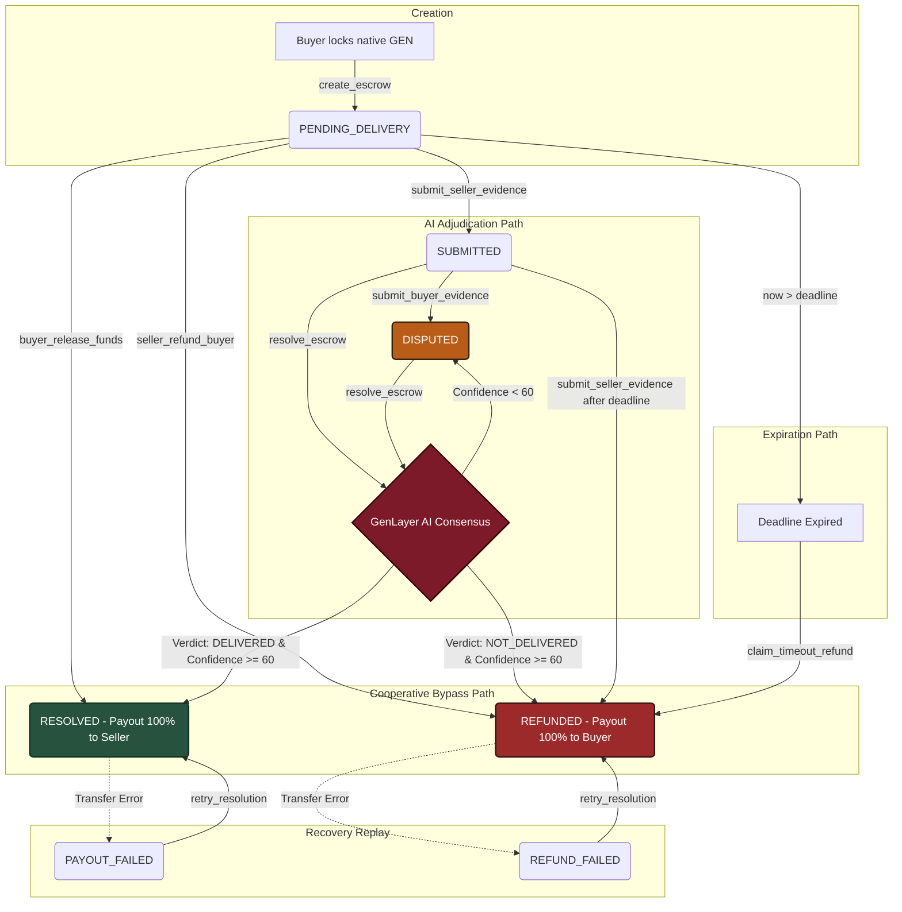

# EquiSettle — Symmetrical Cooperative AI Escrow on GenLayer

EquiSettle is a next-generation, single-contract escrow protocol designed to secure peer-to-peer prepaid transactions (e.g. freelance work, physical goods shipments, digital asset delivery, and ticket swaps) on GenLayer. 

Unlike traditional escrows that rely on expensive human intermediaries or rigid centralized oracles, EquiSettle leverages decentralized multi-validator AI consensus (`gl.vm.run_nondet_unsafe`) to interpret unstructured evidence, shipping logs, and disputes. 

---

## Technical Enhancements Over Standard Escrows

EquiSettle directly addresses and resolves the core architectural limitations of previous AI escrow systems:

1. **Symmetric Two-Sided Evidence:** Standard escrows only allow the seller to upload proof. EquiSettle provides dedicated methods for both the seller (`submit_seller_evidence`) and the buyer (`submit_buyer_evidence`) to record their claims and evidence URLs in the contract state before AI adjudication runs.
2. **Consensus Hardening (No Confidence Splits):** Standard contracts abort validation if independent validators disagree on subjective confidence levels (e.g., confidence 59 vs 61 relative to a threshold of 60). EquiSettle validates consensus strictly on binary verdict equivalence (`my_verdict == leader_verdict`), allowing minor variations in validator confidence scores to pass safely.
3. **Cooperative Settlement Escape Hatches:** If both parties resolve their trade off-chain, the buyer can release funds early (`buyer_release_funds`) or the seller can refund the buyer early (`seller_refund_buyer`), bypassing AI execution entirely and saving network gas and LLM calls.
4. **Replayable Transfer Recovery:** If a native GEN transfer fails due to transient network or EOA proxy limits, the contract transitions to `PAYOUT_FAILED` or `REFUND_FAILED` and allows the participants to replay the settlement via `retry_resolution` without triggering a second AI adjudication run.

---

## Adjudication Lifecycle

Below is the trade flow of an EquiSettle transaction, showing creation, cooperative bypasses, timeout refunds, and validator AI consensus:



---

## Intelligent Contract API

### Write Methods (`@gl.public.write`)
* `create_escrow(seller: Address, description: str, deadline: u256) -> str`
  Opens a secure escrow and locks native GEN.
* `submit_seller_evidence(tx_id: str, urls: DynArray[str], statement: str)`
  Allows the seller to submit delivery proof (requires at least 1 URL). Bypasses AI and refunds the buyer if submitted after the deadline.
* `submit_buyer_evidence(tx_id: str, urls: DynArray[str], statement: str)`
  Allows the buyer to dispute a delivery and submit counter-evidence, transitioning the state to `DISPUTED`.
* `buyer_release_funds(tx_id: str)`
  Cooperative release: Buyer releases 100% of funds to the seller early (bypasses AI).
* `seller_refund_buyer(tx_id: str)`
  Cooperative refund: Seller refunds 100% of funds to the buyer early (bypasses AI).
* `resolve_escrow(tx_id: str)`
  Invokes multi-validator AI consensus. Fetches and parses evidence from both sides symmetrically.
* `claim_timeout_refund(tx_id: str)`
  Allows the buyer to claim a refund if the seller misses the submission deadline.
* `retry_resolution(tx_id: str)`
  Replays a previously agreed-upon verdict if the native transfer failed.

### View Methods (`@gl.public.view`)
* `get_transaction(tx_id: str) -> str (JSON)`
  Returns detailed transaction details, including locked evidence and statements.
* `list_transactions(status_filter: str) -> str (JSON list)`
  Lists transactions filtered by status.
* `get_count() -> int`
* `get_owner() -> str`

---

## Precision Money Rules

To prevent floating-point precision loss and round-off vulnerabilities:
* The contract stores amounts in `bigint` (wei, `1 GEN = 10^18`).
* The frontend implements BigInt-only unit converters (`parseGenToWei` and `formatWeiToGen`).
* An automated linter `frontend/scripts/check-no-float-money.js` runs during prebuild, scanning for floating-point operators (such as `parseFloat` or `Math.round`) near financial variable names, and failing the build if violations are found.

---

## Local Setup & Development

### 1. Requirements
* Python 3.10+
* Node.js 18+

### 2. Contract Testing
```bash
pip install -r requirements-dev.txt
pytest tests -v
```

### 3. Frontend Development
```bash
cd frontend
npm install
npm run check:float
npm run test:money
npm run dev
```

---

## Live Deployment (Bradbury & StudioNet)

To configure the live app for your deployed contract, set your contract address in `frontend/.env`:
```env
VITE_CONTRACT_ADDRESS=0xYourDeployedAddress
```
If no address is configured, the application runs in sandbox demo mode with write actions disabled.
